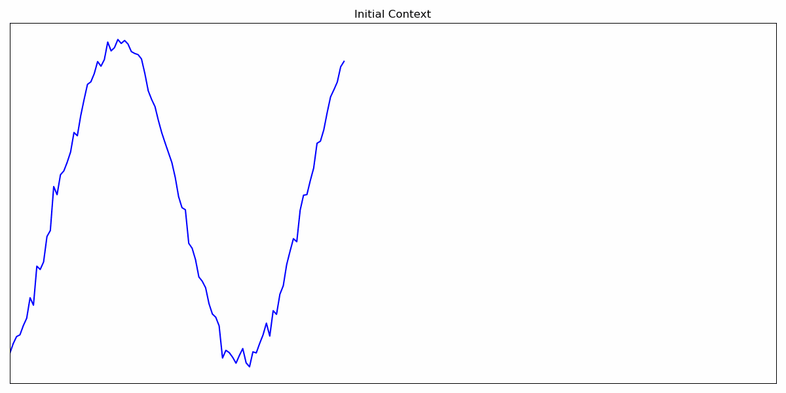
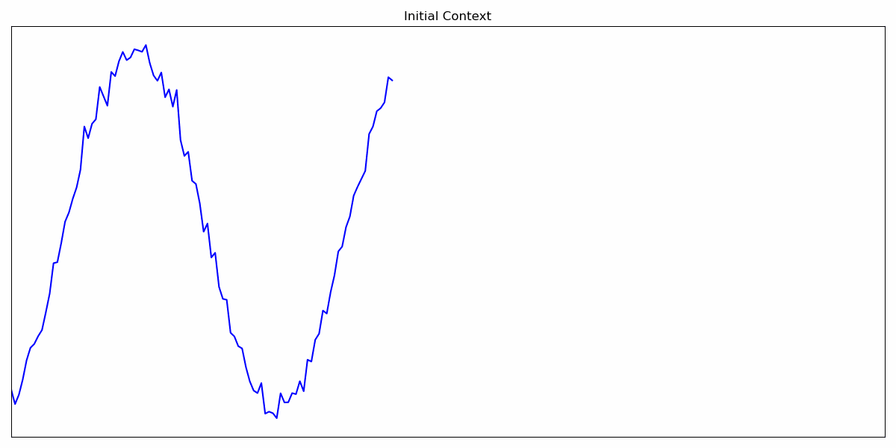

# Does Normalization Choice Matter for Causal Time-Series Foundation Models?

This repository contains the official code for the paper:

**Does Normalization Choice Matter for Causal Time-Series Foundation Models?**

News ⭐: **2025-05-20**: The paper has been accepted at the [ICLR Workshop on Time Series in the Age of Large Models](https://tsalm-workshop.github.io).

---

## Repository Structure

- **`processed_results/`**  
  Contains the experimental results reported in the paper, organized by experiment in separate subfolders.

- **`notebooks/`**  
  Jupyter notebooks used to generate the figures and plots presented in the paper.

- **`conf/`**  
  Configuration files defining datasets, models, normalization strategies, and experimental settings.

- **`main_loop.py`**  
  Main script to run experiments and reproduce the results.

---

## Installation

Install the required dependencies:

```bash
pip install -r requirements.txt
```

---
## Running Experiments

To reproduce a single result from the paper, run:

```bash
python eval.py model.normalizer_name=<NORMALIZER_NAME> model.use_asinh=<True/False> dataset.testsets=[<DATASET_NAME1>,<DATASET_NAME2>,...] model.context_length=<CONTEXT_LENGTH>
```

Where: 
- `<NORMALIZER_NAME>`: One of `CausalRevIN`, `RevIN`, `PrefixRevIN`, `PrefixRevIN2`, `NoRevIN`.  
- `<True/False>`: Whether to use the asinh transformation.  
- `<DATASET_NAME1>,<DATASET_NAME2>,...`: List of dataset names to evaluate on ('gift_eval', 'artificial', 'utsd').  
- `<CONTEXT_LENGTH>`: Context length for the model (Recommend 128, 256, 512, 1024).

To reproduce all results from the paper, run:

```bash
python loop_eval.py
```

To preprocess the raw results run 
```bash 
cd processed_results
python process_raw_results.py 
```

⚠️ **Note:** Running all experiments is computationally expensive and may take a long time.  
To run only a subset of experiments, modify the configuration files in the `conf/` folder (e.g., select specific datasets, models, or normalization methods).

---

## Training Strategy

The complete training pipeline is available in the GitHub repository **[PatchFM](https://github.com/vilhess/PatchFM)**. The released code corresponds to the **CausalRevIN with asinh transformation**.
The training procedure for the other variants — **RevIN**, **PrefixRevIN**, and **NoRevIN** — follows exactly the same protocol (data preprocessing, optimization settings, architecture, and evaluation). The only difference lies in the normalization strategy applied within the model.
In other words, all experimental results are obtained under an identical training setup, ensuring that performance differences are attributable solely to the normalization method.

---

### Autoregressive Inference with Quantile Forecasting ([Moirai 2.0](https://arxiv.org/pdf/2511.11698v1))

During autoregressive inference, the model generates forecasted values patch by patch. At each time step, the predicted patch is fed back into the model as input for the next step. This iterative process continues until the desired forecast horizon is reached.

When performing quantile forecasting, the situation becomes more complex. Instead of producing a single patch per step, the model outputs multiple patches corresponding to different quantiles (e.g., 0.1, 0.5, 0.9). Since the model expects a single patch for the next time step, it is not straightforward to feed all quantile predictions back into the model simultaneously.

A common workaround is to feed only the median prediction (the 0.5 quantile) back into the model at each step. While this approach preserves the autoregressive structure, it discards the uncertainty information captured by the other quantiles.

An alternative approach is **autoregressive multi-quantile decoding**, as proposed in [Moirai 2.0](https://arxiv.org/pdf/2511.11698v1). This method enables consistent autoregressive generation while preserving the full predictive distribution across quantiles. However, it is computationally more expensive than the median-only approach as it requires duplicating the context for each quantile.

<div style="display: flex; gap: 10px; align-items: flex-start;">
  <div>
    
    <p style="text-align:center;">Classic Autoregressive Inference</p>
  </div>
  <div>
    
    <p style="text-align:center;">Autoregressive Multi-Quantile Decoding</p>
  </div>
</div>

The algorithm proceeds as follows:

1. **Initialization**  
   Start with the initial context window of observed data  
   **Shape:** `(BS × L)`  
   - `BS`: batch size  
   - `L`: context length  
   - `P`: patch size  
   - `Q`: number of quantiles  
   - `H`: forecast horizon  
   - `i=1`: current algorithm step

2. **First Quantile Prediction (Forward Pass)**  
   Predict the quantiles for the next patch using the current context.  
   **Output shape:** `(BS × P × Q)`

3. **Context Duplication**  
   For each predicted quantile, create a separate context by appending the corresponding predicted patch to the current context.  
   This increases the number of contexts by a factor of `Q` at each step.  
   **New context shape:** `(BS × Q × i(L + P))`

4. **Next Forward Pass**  
   For each duplicated context, predict the quantiles of the next patch.  
   **Output shape:** `(BS × Q × P × Q)`

5. **Quantile Collapse**  
   - Permute and reshape the predictions to aggregate all possible quantile paths:  
     **Intermediate shape:** `(BS × P × Q²)`  
   - Compute the quantiles across the `Q²` predictions to obtain the final quantile estimates for the next patch.  
     **Final shape:** `(BS × P × Q)`
   - Increment the step counter `i ← i + 1`.

6. **Iteration**  
   Repeat Steps 3–5 until the forecast horizon `H` is reached, i.e., until the total number of predicted time steps satisfies  
   `i × P ≥ H`.

This procedure preserves predictive uncertainty across quantiles while maintaining the autoregressive structure of the model. Although it is computationally more expensive than feeding only the median prediction (0.5 quantile) back into the model, it remains tractable in practice and enables consistent multi-quantile forecasting.

⚠️ **Warning**  
With this strategy, the median prediction (0.5 quantile) does **not necessarily** match the prediction obtained by autoregressively feeding only the median patch back into the model at each step.

This discrepancy arises because the *quantile collapse* step aggregates predictions across all possible quantile paths. As a result, the median is computed from the combined multi-path distribution rather than from a single deterministic trajectory, which can lead to different estimates compared to the single-path (median-only) autoregressive approach.

---

## Datasets and Models

Datasets and pretrained models are automatically downloaded at runtime using the Hugging Face `datasets` and `transformers` libraries. No manual download is required.

---

## Reproducibility Notes

- Results in `processed_results/` correspond to the experiments reported in the paper.
- Configuration files in `conf/` fully specify each experimental setup.